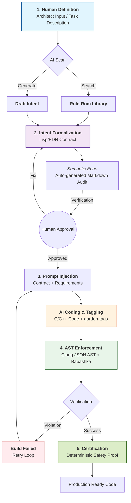

# Intent-Garden (S-OAK) Core

> **Deterministic verification engine for AI-generated C/C++ code.**
>
> We don't believe in "safe languages". We believe in safe intentions.

## 📖 About

**Garden-Core** is a Clojure engine that audits AI-generated C/C++ code through Clang AST and EDN contracts. It serves as the "last mile" between stochastic AI output and predictable code execution.

### How It Works

> **We don't fix AI mistakes. We create an environment where invalid code physically cannot pass the build stage.**

The engine eliminates hallucinations through strict division of labor:

1. **Intent Injection** — AI agent receives specification from `rulerom/registry`
2. **Garden-Tagging** — AI writes C code and marks it with `[[garden:intent(...)]]` tags
3. **AST Enforcement** — Engine parses Clang JSON AST and validates against contracts
4. **Semantic Echo** — Generates Markdown reports for human verification

## 🛠️ Technology Stack

| Component | Purpose |
|-----------|---------|
| **Clojure / Babashka** | Fast data processing logic without JVM overhead |
| **Clang LibTooling** | Parses `-ast-dump=json` for honest code structure |
| **EDN** | Contract format understandable by humans and machines |

## 🔄 Semantic Anchor Lifecycle



## 🚀 Quick Start

### 1. Environment Setup (Windows / Scoop)

```powershell
scoop install babashka llvm
```

### 2. Running Local Audit

Assume you have a `test.c` file with tags:

```c
// [[garden:intent(safe-free)]]
free(p);
p = NULL;
// [[/garden:intent]]
```

**Step 1: Generate AST**

```powershell
clang -Xclang -ast-dump=json -fsyntax-only test.c > ast.json
```

**Step 2: Run Enforcer**

```powershell
bb -m garden.enforcer ast.json
```

### 3. Contract Example (EDN)

```edn
{:intent :safe-free
 :entities [:ptr]
 :must-set-null true
 :description "After free(), pointer must be set to NULL"}
```

## 📋 Tagging Protocol (Garden-Tagging)

Every code block related to an Intent **MUST** be tagged:

```c
// [[garden:intent(INTENT_ID)]]
void implementation_starts_here() {
    // Your logic
}
// [[/garden:intent]]
```

### Tagging Rules

| Rule | Description |
|------|-------------|
| **No Orphans** | Never place a tag without implementation |
| **Exact ID** | `INTENT_ID` must match the key in `.edn` file |
| **Scope** | Tags wrap the smallest logical unit |
| **Vacuum Rule** | Code outside `[[garden:intent]]` is considered dead and discarded |

## 📜 Manifest (Summary)

1. **Code is Cheap, Meaning is Expensive** — value lies in intentions, not instructions
2. **AI is Gas, Formal Logic is Brakes** — deterministic oversight over probabilistic execution
3. **Lisp is the Ideal Contract Language** — homoiconicity for the "Constitution of the System"
4. **Semantic Cage** — AI generates inside a DSL cage of safety rules
5. **Validation Instead of Hope-and-Pray** — check at generation time, not after
6. **Zero-Cost Security** — contract operates at metaprogramming stage
7. **Death of the "Black Box"** — AI as black box implementation in a white box of intentions

## 📄 Documents

| Document | Description |
|----------|-------------|
| [AI Agent Contract](spec/agent_contract.md) | Tagging rules for AI agents |
| [EDN Registry](registry/index.md) | Intent contract specifications |
