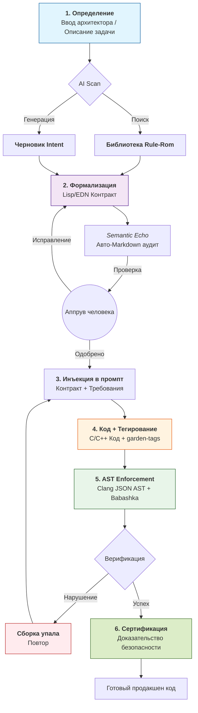

# Intent-Garden (S-OAK) Core

> **Детерминированный движок верификации C/C++ кода, генерируемого ИИ.**
>
> Мы не верим в «безопасные языки». Мы верим в безопасные намерения.

## 📖 О Проекте

**Garden-Core** — это Clojure-движок, который аудирует ИИ-генерированный C/C++ код через Clang AST и EDN-контракты. Это «последняя миля» между стохастическим выводом ИИ и предсказуемым исполнением кода.

### Принцип работы

> **Мы не исправляем ошибки ИИ. Мы создаем среду, где невалидный код физически не может пройти стадию сборки.**

Движок исключает галлюцинации за счет жесткого разделения труда:

1. **Intent Injection** — ИИ-агент получает спецификацию из `rulerom/registry`
2. **Garden-Tagging** — ИИ пишет C-код и размечает его тегами `[[garden:intent(...)]]`
3. **AST Enforcement** — Движок парсит Clang JSON AST и проверяет соответствие контрактам
4. **Semantic Echo** — Генерация Markdown-отчетов для верификации человеком

## 🛠️ Технологический Стек

| Компонент | Назначение |
|-----------|------------|
| **Clojure / Babashka** | Быстрая логика обработки данных без JVM-оверхеда |
| **Clang LibTooling** | Парсинг `-ast-dump=json` для честной структуры кода |
| **EDN** | Формат контрактов, понятный человеку и машине |

## 🔄 Жизненный Цикл «Семантического Якоря»



## 🚀 Быстрый Старт

### 1. Подготовка Окружения (Windows / Scoop)

```powershell
scoop install babashka llvm
```

### 2. Запуск Локального Аудита

Предположим, у вас есть файл `test.c` с расставленными тегами:

```c
// [[garden:intent(safe-free)]]
free(p);
p = NULL;
// [[/garden:intent]]
```

**Шаг 1: Генерируем AST**

```powershell
clang -Xclang -ast-dump=json -fsyntax-only test.c > ast.json
```

**Шаг 2: Запускаем Enforcer**

```powershell
bb -m garden.enforcer ast.json
```

### 3. Пример Контракта (EDN)

```edn
{:intent :safe-free
 :entities [:ptr]
 :must-set-null true
 :description "После free() указатель должен быть установлен в NULL"}
```

## 📋 Протокол Тегирования (Garden-Tagging)

Каждый блок кода, связанный с Intent, **ОБЯЗАТЕЛЬНО** должен быть размечен:

```c
// [[garden:intent(INTENT_ID)]]
void implementation_starts_here() {
    // Ваша логика
}
// [[/garden:intent]]
```

### Правила Тегирования

| Правило | Описание |
|---------|----------|
| **No Orphans** | Никогда не размещайте тег без реализации |
| **Exact ID** | `INTENT_ID` должен совпадать с ключом в `.edn` файле |
| **Scope** | Теги оборачивают минимальную логическую единицу |
| **Vacuum Rule** | Код вне `[[garden:intent]]` считается мёртвым и отбрасывается |

## 📜 Манифест (Кратко)

1. **Код обесценился, Смысл подорожал** — ценность в намерениях, а не инструкциях
2. **ИИ — Газ, Формальная Логика — Тормоза** — детерминированный надзор над вероятностным исполнением
3. **Lisp — идеальный язык Контрактов** — гомоиконность для «Конституции системы»
4. **Семантическая Клетка** — ИИ генерирует внутри DSL-клетки правил безопасности
5. **Валидация вместо Надейся-и-Жди** — проверка на этапе генерации, не после
6. **Zero-Cost Security** — контракт работает на этапе метапрограммирования
7. **Смерть «Черного Ящика»** — ИИ как чёрный ящик реализации в белом ящике намерений

## 📄 Документы

| Документ | Описание |
|----------|----------|
| [Контракт для ИИ-агентов](spec/agent_contract.md) | Правила тегирования |
| [EDN Реестр](registry/index.md) | Спецификации Intent-контрактов |
